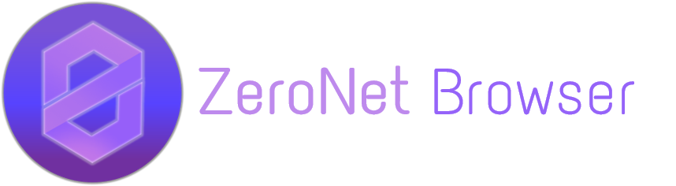
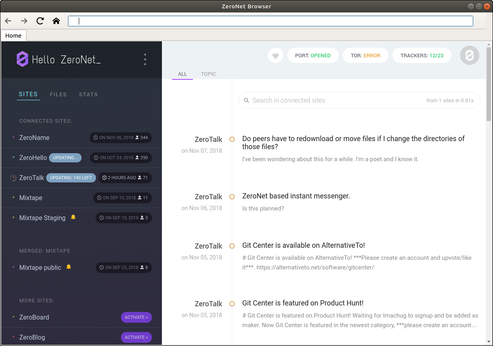
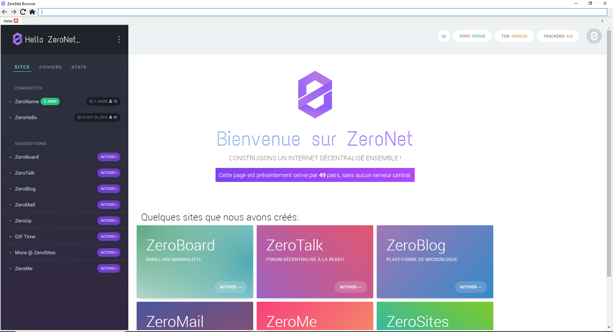

# 

[](https://travis-ci.org/rllola/ZeronetBrowser)
[](https://ci.appveyor.com/project/rllola/zeronetbrowser/)

An attempt to create a dedicated browser for ZeroNet using PyQt5

This browser advantage compare to others is that it is bundle with ZeroNet in it.

It understand zero: url and will soon be filled with others ZeroNet specific features (dev tools, blocking clearnet, zeronet gui commands, app store, Tor out of the box, ...).

## About

This project offer a custom browser with ZeroNet bundle in it.

A custom browser could have several advantages :
- Understanding `zero:` url
- Offering specific dev tool for ZeroNet site development
- Blocking clearnet site or opening them in default browser
- ZeroNet GUI for commands (more user friendly)
- Plugin store ???
- etc...

It can also help non-tech people understanding what is running on the ZeroNet protocol and what is clearnet. The `127.0.0.1:43110` seems to be confusing for people.

## Download

ZeroNet Browser run on Linux, Windows and Mac OS*. You can download the release that fit you on the release page : https://github.com/rllola/ZeronetBrowser/releases

*Mac OS doesn't entirely works. Help is needed to properly package it.

## Screenshot

### Linux



### Windows



## Development

You will need python 2.7.

### Setup

Install Python 2.7, PyQt 5.11.2 (see provision.sh) and pip.

```
$ pip install msgpack gevent enum34 pyinstaller cffi
$ pip install --upgrade setuptools
```

1,2,3... Code!

```
python launch.py
```

### Vagrantfile

You can create your executable in Vagrant.
```
$ vagrant up
```

### Pyinstaller

You can create an executable with pyinstaller.
```
pyinstaller browser.spec
```

## Help

You don't have to be a programmer to contribute. You can also help us by testing the browser, give us feedback, helping with the documentation, design, etc...
